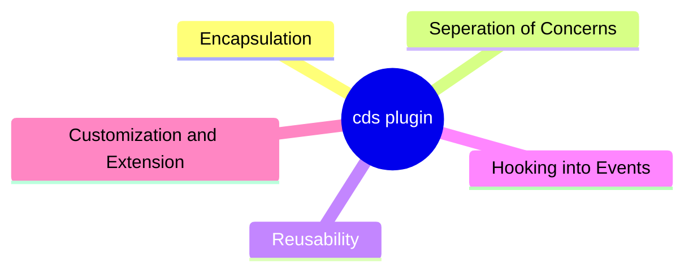

## What is a CDS Plugin?

*CDS Plugin* concept allows developers to encapsulate functionality and separate it from the main application code. These plugins are designed to be easily reusable in multiple applications, promoting modularity and code reuse. They enable you to extend and enhance the capabilities of your CAP applications by hooking into standard events and registering event handlers.

A master-piece and popular example plugin might be seen [here](https://github.com/cap-js-community/odata-v2-adapter).

A very nice blog post from our CAP Colleague Daniel Schlachter can be seen [here.](https://blogs.sap.com/2023/04/30/reusable-components-for-cap-with-cds-plugin/)

## General Idea

## Why would I develop a CDS plugin?

- Encapsulation of Functionality: Plugins in CAP can encapsulate specific pieces of functionality, such as custom service implementations, authorization checks, or event handlers. This encapsulation helps in keeping the main application code clean and organized.

- Separation of Concerns: By separating functionality into plugins, you can maintain a clear separation of concerns within your application. Each plugin can focus on a specific aspect or feature of the application.

- Reusability: One of the primary benefits of plugins is their reusability. Once you've defined and tested a plugin, you can easily reuse it in multiple CAP applications, reducing duplication of code and effort.

- Hooking into Standard Events: CAP provides standard events like once.served, which allows you to hook into the application lifecycle. For example, you can use this event to perform custom initialization or logging when the application is served.

- Customization and Extension: Plugins are a powerful way to customize and extend the behavior of your CAP applications without modifying the core application code. This makes it easier to adapt your application to changing requirements.

## How CDS Plugins are consumed in CAP Node.js Runtime? 
CDS Plugin can be published as a npm module, which can then be used in CAP Node.js runtime environments. This modular approach makes it easy to share and distribute your plugins with other developers or reuse them in different CAP applications.
They just need to add the plugin to their npm dependencies.

## Step by Step CDS Plugin Developement
In this section you will be developing your CDS plugin, for translation.

### Scenario
We would like to develop a plugin for the community which they can use for automatic real time translation 

Target status would be something like below:

```sh
using my.bookshop as my from '../db/data-model';

service CatalogService {
    @readonly entity Books as projection on my.Books;
}

annotate CatalogService.Books with {
    description @cds.translate;
}
```

And the expected behaviour would be the following:
 - If any element of entity has *@translate* annotation, CAP framework should use our plugin and translate that to the target language.

### Prerequisites
- You must have have Docker installed.
- You must have NodeJS installed.
- You must have @sap/cds-dk npm module installed.

### Step 1. Start our local translation engine 

We will use LibreTranslate instance as translation, which is able to translate English-Italian and Italian-English.
[LibreTranslate](https://libretranslate.com/) is a free and open source machine translation API which we can use locally.

```sh
docker run -p 5001:5000 -ti --rm  -e LT_LOAD_ONLY=it,en libretranslate/libretranslate
```
**Hint**: Your translator should be reachable under *http://localhost:5001/translate*

You can send request below to test it.

```sh
 curl -X POST  http://localhost:5001/translate -H 'Content-Type:application/json' -d '  {
    "q": "Ciao!",
    "source": "it",
    "target": "en"
  }'
```

### Step 2. Bootstrap a CAP Application

```sh
cds init rome --add nodejs,samples,sqlite
```
### Step 3. Bootstrap your CDS Plugin 
```sh
cd rome 
mkdir cds-translator 
cd cds-translator 
npm init -y
touch cds-plugin.js
```
Create a new file called **/cds-translator/cds-plugin.js**

> **cds-plugin.js** is a special filename! It will be the entry point to your plugin. CAP Framework 
> loads this file, and understands that this is a cds-plugin!

### Step 4. Add Console Log statement to your cds-plugin.js for test

```js
console.log("Alper")
```

### Step 5. Add your cds-plugin as a dependency to CAP Applications *package.json*

```json
{
  "name": "rome",
  "version": "1.0.0",
  "description": "A simple CAP project.",
  "repository": "<Add your repository here>",
  "license": "UNLICENSED",
  "workspaces":["cds-translator"], // This line
  "private": true,
  "dependencies": {
    "@sap/cds": "^7",
    "express": "^4",
    "cds-translator":"*"  // this line 
  },
  "devDependencies": {
    "@cap-js/sqlite": "^1"
  },
  "scripts": {
    "start": "cds-serve"
  }
}
```

And after that run an npm install!
```sh
npm install
```

### Step 6. Add logic for translation to your plugin

```js
const cds = require('@sap/cds')

async function translate(text,target){
    const res = await fetch("http://localhost:5001/translate", {
        method: "POST",
        body: JSON.stringify({
            q: text,
            source: "en",
            target: target,
            format: "text",
        }),
        headers: { "Content-Type": "application/json" }
    });
    
   return res.json()
}

cds.once('served', (whatever) => {
  for (let srv of cds.services) {
    for (let entity of srv.entities) {
      const translationRegistry = new Map();
      for (const key in entity.elements) {
        const element = entity.elements[key]
        if (element['@translate']){
          if(!translationRegistry.has(entity.name)){
             translationRegistry.set(entity.name,[])
          }
          let elements = translationRegistry.get(entity.name);
          elements.push(element.name)
          translationRegistry.set(entity.name,elements);
        }
      }
      if (translationRegistry.size > 0) {
        srv.after('READ', entity.name, async (datas) => {
           if (translationRegistry.has(entity.name)){
              const elements = translationRegistry.get(entity.name);
              for (let data of datas) {
                for (const element of elements){
                  const translation =  await translate(data[element],"it");
                  data[element] = translation.translatedText;
                 }
              }
           }
        })
      }
    }
  }
})
```

### Step 7. Add **@cds.translate** annotation

Go to the [cat-service.cds](rome/srv/cat-service.cds) and add the annotation as shown below.

```sh
using my.bookshop as my from '../db/data-model';

service CatalogService {
    @readonly entity Books as projection on my.Books;
}

annotate CatalogService.Books with {
    description @cds.translate;
}
```
### Step 8. Modify the DB contents by adding description

Go to your [rome/db/data/my.bookshop-Books.csv](rome/db/data/my.bookshop-Books.csv) and add description field to CSV as shown below.

```csv
ID;title;stock;description
1;Wuthering Heights;100;Great Book
2;Jane Eyre;500; Very nice to read you
```

### Step 9. Start your CAP application locally and send the request

Run the command below to start your CAP application.
```sh
cd rome
npm run start
```
After that open a new terminal and send the request as below.
```sh
curl http://localhost:4004/odata/v4/catalog/Books
```

Congrats! You developed your first plugin!
